```{r setup, include=FALSE}
knitr::opts_chunk$set(echo = FALSE)
```

## Um pouco sobre nosso pacote

- Criamos, para a realização deste trabalho, o pacote __qqr__.

- O pacote se baseia na tabela do Brasileirão.
- Nosso pacote mostra a tabela de anos diferentes do Brasileirão.
- Para baixar nosso pacote, use o comando __devtools::install_github("https://github.com/jeff25601/qqr")__

```{r,eval=FALSE,echo=T}
devtools::install_github("https://github.com/jeff25601/qqr")  
```

## O Pacote devtools

- __devtools__ é um pacote que auxilia na criação e desenvolvimento de pacotes.

- O __devtools__ pode ser utilizado dentro de uma sessão do R.

- Nosso pacote, __qqr__, foi desenvolvido a partir do __devtools__.

- Para mais informações, acesse:
  - https://devtools.r-lib.org/
  - https://rawgit.com/rstudio/cheatsheets/master/package-development.pdf
  - https://r-pkgs.org/index.html

## Passo a passo: parte 1

- O ambiente do pacote

- Estrutura do pacote

- As funções do pacote

- Adicionando bases de dados ao pacote

- Documentação das funções e bases de dados

## O ambiente do pacote

- Para criar o ambiente do pacote, siga as seguintes etapas:
- 1) Clique em R Project > New Project

<center>
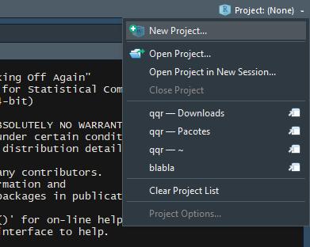
</center>

## O ambiente do pacote
- 2) Selecione New Directory > R Package.

<center>
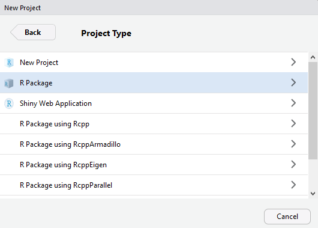
</center>

## O ambiente do pacote
- 3) Preencha com as informações adequadas

<center>
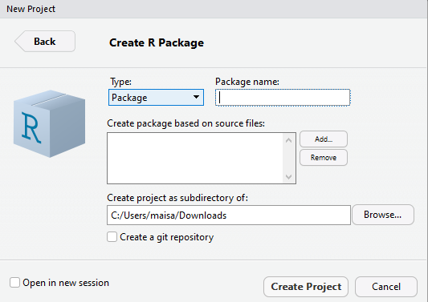
</center>

## O ambiente do pacote

- Alternadamente, podemos utilizar o comando __create(‘qqr’)__.

```{r,eval=FALSE,echo=T}
devtools::create('qqr')
```

## Estrutura do Pacote
- A base do pacote:	
  - Pasta __R__
  - Pasta __man__
  - Arquivo __DESCRIPTION__
  - Arquivo __NAMESPACE__ 

<center>
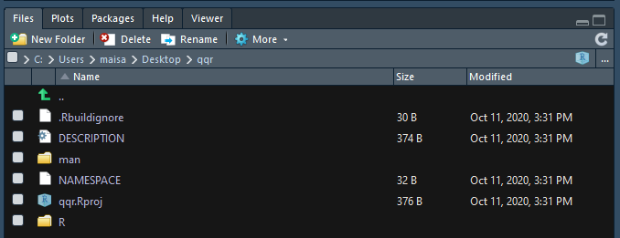
</center>

## Estrutura do Pacote
- Opcionais:
  - Pasta __tests__
  - Pasta __vignettes__
  - Pasta __data__

## As funções do pacote

- Como criar funções para o pacote

<center>
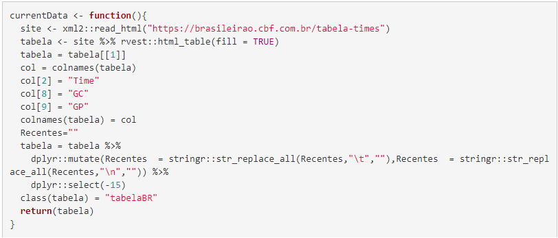
</center>

## As funções do pacote

- Testando as funções

```{r,eval=FALSE,echo=T}
load_all() #carrega as funções
unload_all() #descarrega as funções
```

## Adicionando bases de dados ao pacote

- Como adicionar uma base de dados ao pacote?
  - Salve sua base de dados em um objeto
  - Salve o objeto em __rda__

```{r,eval=FALSE,echo=T}
saveRDS(object = dados, file='qqr/data/dados.rda')
```

## Documentação das funções e bases de dados

- Uma boa documentação é importante para a criação de um bom pacote
- Documentação padrão: arquivos __.RD__ no diretório __/man__
- A sintaxe é customizada

<center>
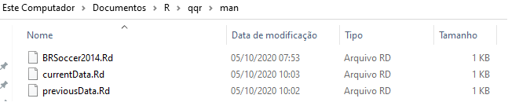
</center>

## Documentação das funções e bases de dados
- Para documentar as funções e bases de dados, utilizaremos o pacote __roxygen2__

- O pacote __roxygen2__ permite documentar a função ou base de dados dentro do próprio código

- Iniciamos o processo com os caracteres __#’__ ao início da linha

## Documentando uma função com o _roxygen2_

- Blocos e tags

<center>
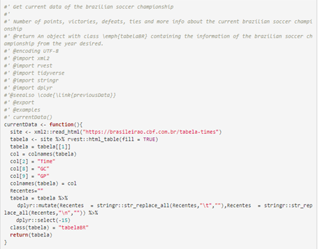
</center>

## Documentando uma função com o _roxygen2_

Principais tags:

- @aliases
- @param
- @return
- @examples
- @export
- @seealso
- @usage
- @references
- @import

## Documentando bancos de dados com o _roxygen2_

<center>
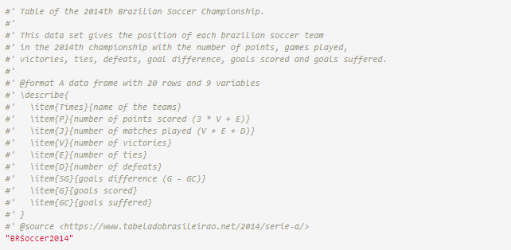
</center>

## Documentando bancos de dados com o _roxygen2_

Principais tags:

- @aliases
- @format
- @examples
- @seealso
- @usage
- @source
- @references

## Passo a passo: Parte 2

- Arquivo _DESCRIPTION_
- Vignettes
- Preparando o pacote para instalação
- Instalando o pacote localmente
- Publicando o pacote

## O arquivo _DESCRIPTION_
- Tem como objetivo armazenar metadados sobre o pacote

- Registra outros pacotes necessários para rodar seu pacote

- Informa condições de uso e quem contatar caso necessário

## O arquivo _DESCRIPTION_
- Itens do arquivo:
  - Package
  - Version
  - Title
  - Description
  - Lazydata

## O arquivo _DESCRIPTION_

- Arquivo _DESCRIPTION_ do qqr

<center>
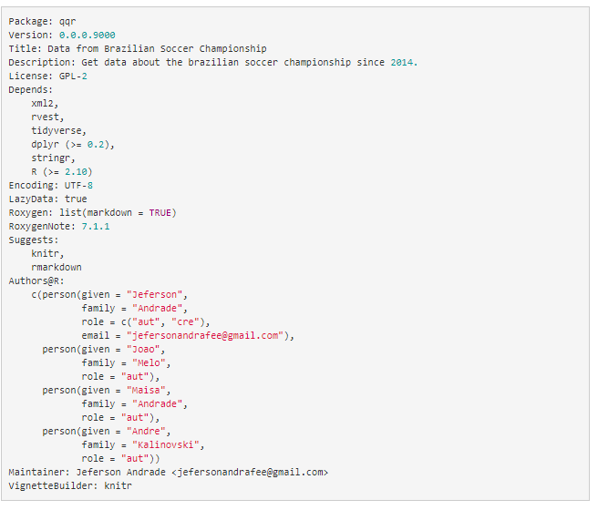{#id .class width=500 height=400px}
</center>

## O arquivo _DESCRIPTION_

- Autores: __name, email, role__
- Mantenedor
- Licença

## O arquivo _DESCRIPTION_

- __Imports__
- __Suggests__
- __Enhances__

## Vignettes

- É um guia mais elaborado a respeito de seu pacote
- Explica o processo de criação e desenvolvimento do pacote
- Detalhar esse processo se torna muito importante à medida que o pacote se torna mais elaborado

- Como criar um vignette?

```{r, eval=FALSE, echo=TRUE}
usethis::use_vignette("qqr Package")
```

## Vignettes

- Estrutura de metadados:

<center>
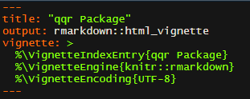
</center>

- O final do processo:

```{r, eval=FALSE, echo=TRUE}
devtools::build_vignettes()
```

## Preparando o pacote para instalação

- Embora boa parte do trabalho já tenha sido feita, ainda é preciso transformar as documentações
- Para isso, utilize a função __document__

```{r, eval=FALSE, echo=TRUE}
devtools::document()
```

- Caso necessário compilar, faça uso da função __compile_dll__

```{r, eval=FALSE, echo=TRUE}
pkgbuild::compile_dll()
```

## Instalando o pacote localmente

- Para instalar o pacote, utilize a função __install__

```{r, eval=FALSE, echo=TRUE}
devtools::install()

#carregando o pacote
library(qqr)
```

## Publicando o pacote 

- Publicando no GitHub:
  - Instale o GitHub em seu computador
  - Crie uma conta no GitHub
  - Crie um novo repositório
  - Clique com o botão direito na pasta de seu pacote e selecione a opção __Git Bash Here__

<center>
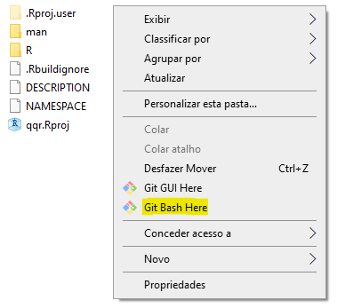{#id .class width=250 height=280px}
</center>

## Publicando o pacote

  - Coloque seu email e nome de usuário

<center>
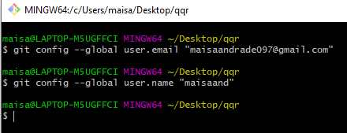
</center>

  - Vá ao R e conecte sua pasta local ao servidor

<center>
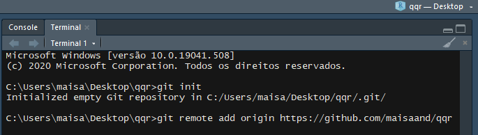
</center>

## Publicando o pacote

  - Para adicionar os arquivos ao GitHub, utilize o comando:

```{r, echo=TRUE, eval=FALSE}
git add .
```

  - Salve os arquivos com o comando

```{r, echo=TRUE, eval=FALSE}
git commit -m"comentário qualquer"
```

  - Por fim, para subir os arquivos para o repositório:

```{r, echo=TRUE, eval=FALSE}
git push -u origin master
```

## Publicando no CRAN

- Publicar no CRAN é mais complicado, uma vez que é necessária a aprovação do pacote

- Utilize a função __check__ para checar possíveis erros e avisos

```{r, echo=TRUE, eval=FALSE}
devtools::check()
```

<center>
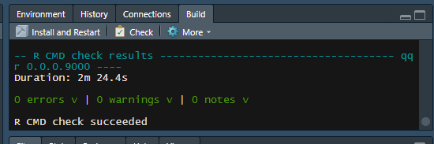
</center>

## Publicando no CRAN

- Passando pelo teste de erros e avisos, podemos continuar o processo
- O diretório da função deve estar em formato __tar.gz__
- Para isso, utilize a função __build__

```{r, echo=TRUE, eval=FALSE}
devtools::build()
```
- Por fim, acesse https://cran.r-project.org/submit.html e faça a submissão do pacote

## Referências

- http://cursos.leg.ufpr.br/prr/capPacR.html#
- https://cran.r-project.org/web/packages/devtools/index.html
- https://cran.r-project.org/doc/contrib/Leisch-CreatingPackages.pdf
- https://developer.r-project.org/Rds.html
- https://cran.r-project.org/doc/manuals/r-release/R-exts.html#Package-Dependencies
